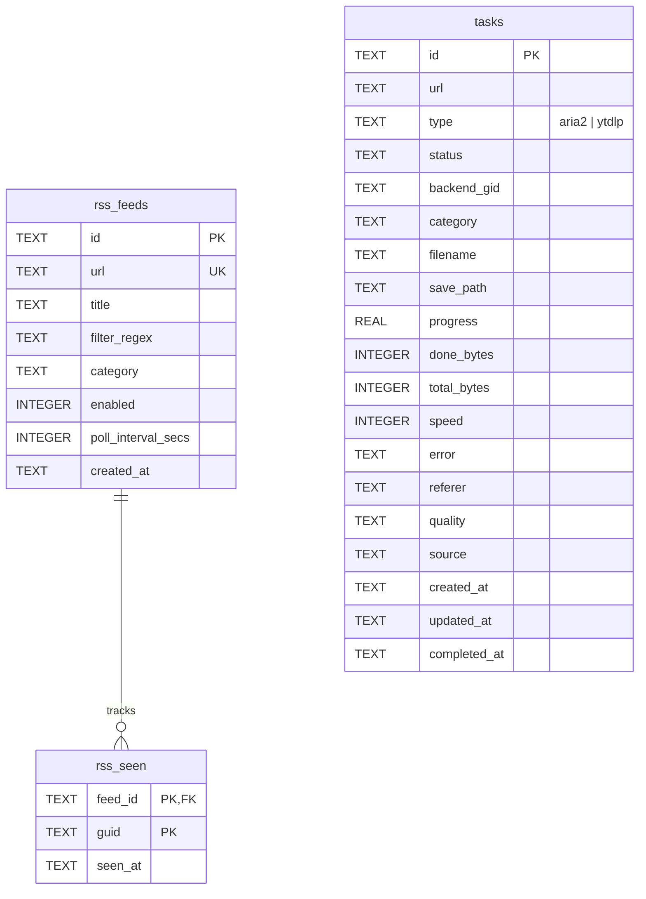

# Data Schema

SQLite database for download tasks and RSS feed polling.

**Source:** [`server/src/store.rs`](../server/src/store.rs) (embedded DDL in `Store::open`)

## Entity relationship diagram

## Tables

### `tasks`

Download jobs managed by aria2 or yt-dlp backends.

| Column | Type | Notes |
|--------|------|-------|
| `id` | TEXT | PK (UUID) |
| `url` | TEXT | Download URL |
| `type` | TEXT | `aria2` or `ytdlp` |
| `status` | TEXT | `pending`, `downloading`, `paused`, `completed`, `failed`, `removed` |
| `backend_gid` | TEXT | Backend-specific job ID |
| `category` | TEXT | Default `inbox` |
| `filename`, `save_path` | TEXT | Output paths |
| `progress` | REAL | 0.0–1.0 |
| `done_bytes`, `total_bytes`, `speed` | INTEGER | Transfer stats |
| `error` | TEXT | Failure message |
| `referer`, `quality`, `source` | TEXT | Optional request metadata |
| `created_at`, `updated_at`, `completed_at` | TEXT | RFC 3339 timestamps |

**Indexes:** `status`, `created_at DESC`

### `rss_feeds`

Configured RSS/Atom feeds for automatic download enqueueing.

| Column | Type | Notes |
|--------|------|-------|
| `id` | TEXT | PK (UUID) |
| `url` | TEXT | UNIQUE feed URL |
| `title` | TEXT | Display name |
| `filter_regex` | TEXT | Optional item filter |
| `category` | TEXT | Default `inbox` |
| `enabled` | INTEGER | 0/1 boolean |
| `poll_interval_secs` | INTEGER | Default 300 |
| `created_at` | TEXT | RFC 3339 |

### `rss_seen`

Dedup table for processed feed items.

| Column | Type | Notes |
|--------|------|-------|
| `feed_id` | TEXT | FK → `rss_feeds(id)` (logical; no FK constraint) |
| `guid` | TEXT | Item GUID from feed |
| `seen_at` | TEXT | RFC 3339 |

**Primary key:** `(feed_id, guid)`. Deleted when parent feed is removed.
